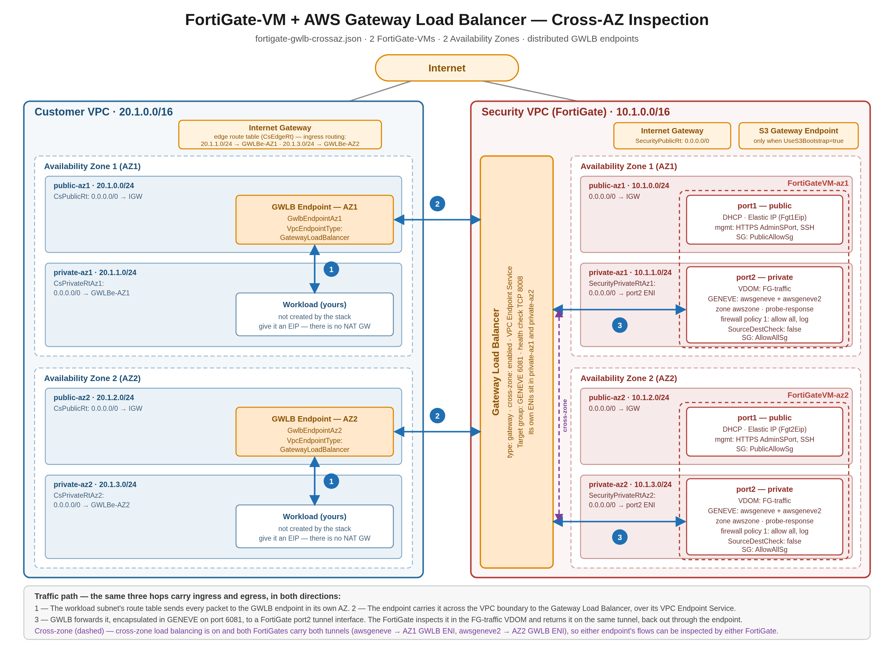
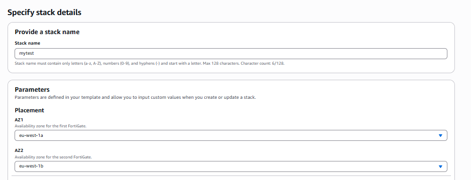
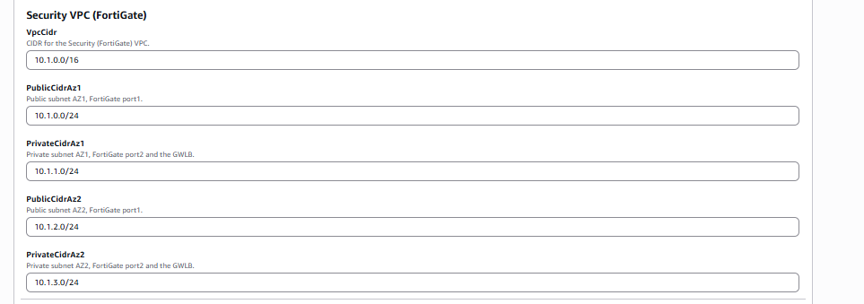
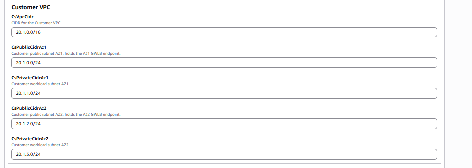
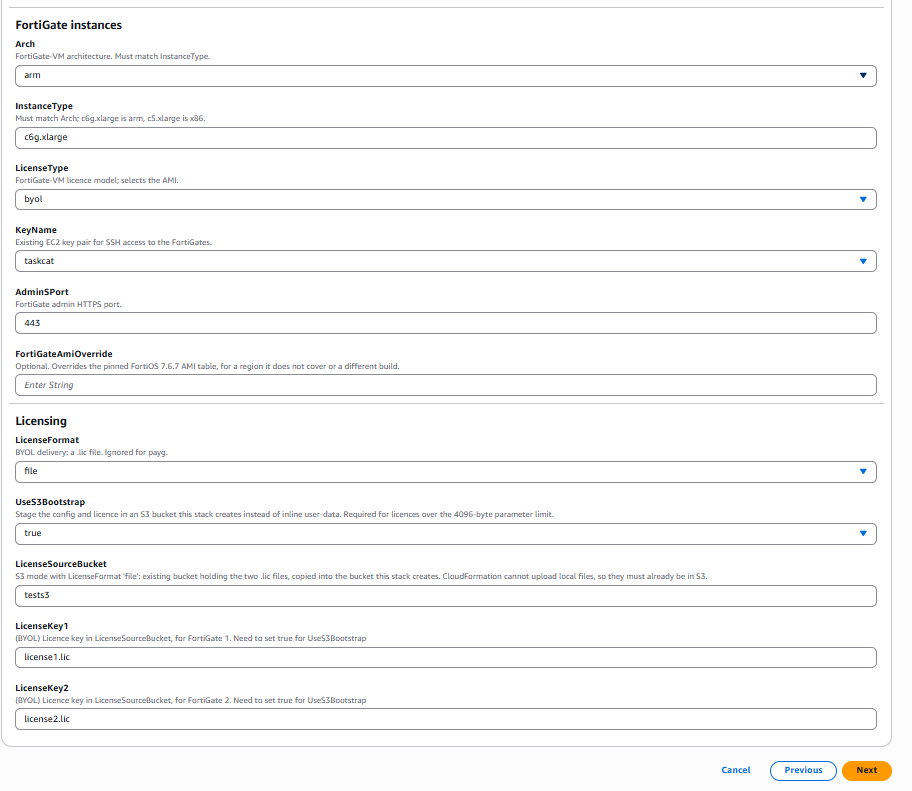
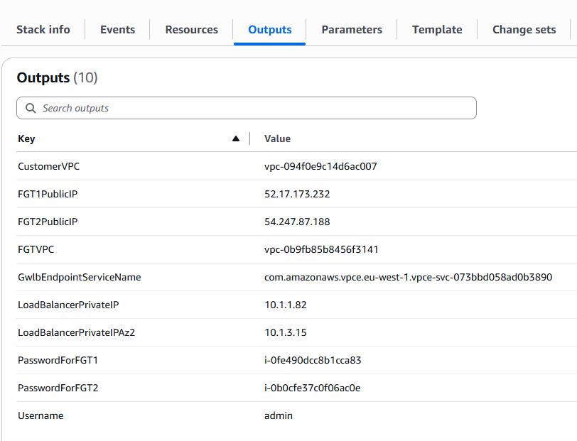
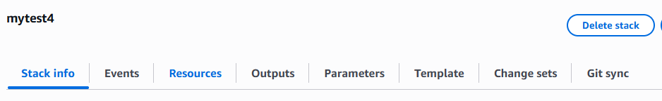

# FortiGate-VM with AWS Gateway Load Balancer — Cross-AZ Deployment

A CloudFormation template that deploys two FortiGate-VMs (BYOL or PAYG) into two
Availability Zones behind an AWS Gateway Load Balancer, together with a second
"customer" VPC whose workload subnets send all traffic through the FortiGates for
inspection via per-AZ Gateway Load Balancer endpoints.

Everything is created by one stack: both VPCs, all routing, the load balancer, the
endpoint service, the endpoints, and the FortiOS bootstrap configuration. No manual
FortiGate configuration is needed to get traffic flowing.



## Package contents

| File | What it is |
| --- | --- |
| `fortigate-gwlb-crossaz.json` | The CloudFormation template — 67 resources, 23 parameters, 10 outputs. |
| `parameters.json` | Ready-to-edit parameter file for `aws cloudformation` CLI deployment. |
| `aws-gwlb-crossaz.png` | The architecture diagram above. |
| `content/aws-gwlb-crossaz.svg` | Editable source for the diagram. |
| `content/screen*.PNG` | Console screenshots used in the deployment walkthrough below. |
| `README.md` | This file. |

## Table of contents

- [Deployment topology](#deployment-topology)
  - [Address plan](#address-plan)
  - [Routing](#routing)
  - [Traffic flow](#traffic-flow)
- [What the template creates](#what-the-template-creates)
- [FortiOS bootstrap configuration](#fortios-bootstrap-configuration)
- [Prerequisites](#prerequisites)
- [Parameters](#parameters)
- [Deployment](#deployment)
  - [AWS Console](#aws-console)
  - [AWS CLI](#aws-cli)
- [Outputs and first login](#outputs-and-first-login)
- [Verifying the deployment](#verifying-the-deployment)
- [Attaching more spoke VPCs](#attaching-more-spoke-vpcs)
- [Destroying the deployment](#destroying-the-deployment)
- [Notes and limitations](#notes-and-limitations)
- [Support](#support)
- [License](#license)

## Deployment topology

Two VPCs, two Availability Zones, and one Gateway Load Balancer that spans both AZs.

The **Security VPC** holds the FortiGates and the load balancer. Each FortiGate-VM has
two interfaces: `port1` in the public subnet of its AZ with an Elastic IP for management
and internet access, and `port2` in the private subnet of the same AZ. `port2` is moved
into a dedicated `FG-traffic` VDOM and carries two GENEVE tunnel interfaces — one to each
AZ's Gateway Load Balancer ENI.

The **Customer VPC** holds your workloads. It never sees a FortiGate directly. Instead,
each AZ has a Gateway Load Balancer endpoint in its public subnet, and the workload
subnet's route table points its default route at that endpoint. Ingress from the internet
is redirected the same way, through an edge route table associated with the Internet
Gateway.

Because cross-zone load balancing is enabled on the GWLB and both FortiGates carry
tunnels to both GWLB ENIs, either FortiGate can inspect traffic from either endpoint.
A FortiGate failure in one AZ does not black-hole the other AZ's traffic.

### Address plan

Defaults shown; every CIDR is a parameter.

**Security VPC — `10.1.0.0/16`**

| Subnet | CIDR | AZ | Contents |
| --- | --- | --- | --- |
| `public-az1` | `10.1.0.0/24` | AZ1 | FortiGate 1 `port1`, Elastic IP |
| `private-az1` | `10.1.1.0/24` | AZ1 | FortiGate 1 `port2`, GWLB ENI |
| `public-az2` | `10.1.2.0/24` | AZ2 | FortiGate 2 `port1`, Elastic IP |
| `private-az2` | `10.1.3.0/24` | AZ2 | FortiGate 2 `port2`, GWLB ENI |

**Customer VPC — `20.1.0.0/16`**

| Subnet | CIDR | AZ | Contents |
| --- | --- | --- | --- |
| `public-az1` | `20.1.0.0/24` | AZ1 | GWLB endpoint (AZ1) |
| `private-az1` | `20.1.1.0/24` | AZ1 | Your workloads (AZ1) |
| `public-az2` | `20.1.2.0/24` | AZ2 | GWLB endpoint (AZ2) |
| `private-az2` | `20.1.3.0/24` | AZ2 | Your workloads (AZ2) |

Workload instances are **not** created by this stack. Launch your own into the two
private subnets of the Customer VPC.

### Routing

**Security VPC**

| Route table | Associated with | Route |
| --- | --- | --- |
| `SecurityPublicRt` | both public subnets | `0.0.0.0/0` → Internet Gateway |
| `SecurityPrivateRtAz1` | `private-az1` | `0.0.0.0/0` → FortiGate 1 `port2` ENI |
| `SecurityPrivateRtAz2` | `private-az2` | `0.0.0.0/0` → FortiGate 2 `port2` ENI |

**Customer VPC**

| Route table | Associated with | Route |
| --- | --- | --- |
| `CsEdgeRt` | the Internet Gateway (edge association) | `20.1.1.0/24` → GWLB endpoint AZ1<br>`20.1.3.0/24` → GWLB endpoint AZ2 |
| `CsPublicRt` | both public subnets | `0.0.0.0/0` → Internet Gateway |
| `CsPrivateRtAz1` | `private-az1` | `0.0.0.0/0` → GWLB endpoint AZ1 |
| `CsPrivateRtAz2` | `private-az2` | `0.0.0.0/0` → GWLB endpoint AZ2 |

The edge route table is what makes **ingress** inspection work: traffic arriving at the
Internet Gateway for a workload subnet is handed to that AZ's GWLB endpoint before it
reaches the workload. The private route tables do the same for **egress**. Both
directions traverse the same FortiGate, so the flow stays symmetric.

### Traffic flow

1. A packet leaves (or is destined for) a workload in a Customer VPC private subnet. The
   subnet's route table — or the IGW edge route table, for ingress — sends it to the GWLB
   endpoint in the same AZ.
2. The endpoint carries it across the VPC boundary to the Gateway Load Balancer through
   the VPC endpoint service.
3. The GWLB encapsulates it in GENEVE (UDP 6081) and forwards it to a FortiGate `port2`
   tunnel interface. The FortiGate inspects it in the `FG-traffic` VDOM and returns it on
   the same tunnel; the GWLB hands it back to the endpoint, which releases it into the
   Customer VPC to continue to its destination.

Two FortiOS router policies pin each flow to the tunnel it arrived on, so return traffic
leaves the way it came in and the GWLB's flow stickiness is preserved.

## What the template creates

67 resources:

| Group | Count | Resources |
| --- | --- | --- |
| Security VPC networking | 17 | VPC, 4 subnets, IGW + attachment, 3 route tables, 3 routes, 4 subnet associations |
| Customer VPC networking | 21 | VPC, 4 subnets, IGW + attachment, 4 route tables, 6 routes, edge association, 4 subnet associations |
| Security groups | 2 | `PublicAllowSg` (SSH/443/8443), `AllowAllSg` (all traffic) |
| FortiGate interfaces | 4 | `port1` and `port2` ENIs for each FortiGate (`port2` has `SourceDestCheck: false`) |
| Gateway Load Balancer | 6 | GWLB, GENEVE target group, listener, endpoint service, 2 endpoints |
| Bootstrap, S3, IAM | 9 | Bootstrap bucket, FortiGate role + instance profile, S3 gateway endpoint, helper Lambda + role, 3 custom resources |
| Instances and addressing | 8 | 2 instances, 2 `port2` attachments, 2 EIPs, 2 EIP associations |


## FortiOS bootstrap configuration

Both FortiGates receive the same configuration, differing only in the substituted values.
It is written once in the template and delivered either inline through EC2 user data or
staged in S3, depending on `UseS3Bootstrap`.

```
config system global
    set hostname FGTVM-GWLB
    set admin-sport ${adminsport}
end
config system interface
    edit port1
        set alias public
        set mode dhcp
        set allowaccess ping https ssh fgfm
    next
    edit port2
        set alias private
        set mode dhcp
        set allowaccess ping https ssh fgfm probe-response
        set defaultgw disable
    next
end
config system probe-response
    set mode http-probe
end
config system global
    set vdom-mode multi-vdom
end
config vdom
    edit root
        config system settings
            set vdom-type admin
        end
    next
    edit FG-traffic
    next
end
config global
    config system interface
        edit port2
            set vdom FG-traffic
        next
    end
end
config vdom
    edit FG-traffic
        config system geneve
            edit "awsgeneve"
                set interface "port2"
                set type ppp
                set remote-ip ${endpointip}
            next
            edit "awsgeneve2"
                set interface "port2"
                set type ppp
                set remote-ip ${endpointip2}
            next
        end
        config system zone
            edit awszone
                set interface awsgeneve awsgeneve2
            next
        end
        config firewall policy
            edit 1
                set name "test"
                set srcintf "awszone"
                set dstintf "awszone"
                set srcaddr "all"
                set dstaddr "all"
                set action accept
                set schedule "always"
                set service "ALL"
                set logtraffic all
            next
        end
        config router static
            edit 1
                set device awsgeneve
            next
            edit 2
                set device awsgeneve2
            next
            edit 3
                set device port2
                set dst ${dst}
                set gateway ${gateway}
            next
        end
        config router policy
            edit 1
                set input-device "awsgeneve"
                set src "0.0.0.0/0.0.0.0"
                set dst "0.0.0.0/0.0.0.0"
                set output-device "awsgeneve"
            next
            edit 2
                set input-device "awsgeneve2"
                set src "0.0.0.0/0.0.0.0"
                set dst "0.0.0.0/0.0.0.0"
                set output-device "awsgeneve2"
            next
        end
    next
end
```

Substituted values:

| Placeholder | FortiGate 1 | FortiGate 2 |
| --- | --- | --- |
| `${adminsport}` | `AdminSPort` | `AdminSPort` |
| `${endpointip}` | AZ1 GWLB ENI address | AZ1 GWLB ENI address |
| `${endpointip2}` | AZ2 GWLB ENI address | AZ2 GWLB ENI address |
| `${dst}` | `PrivateCidrAz2` | `PrivateCidrAz1` |
| `${gateway}` | first host of `PrivateCidrAz1` | first host of `PrivateCidrAz2` |

Static route 3 is what makes the cross-AZ tunnels reachable: each FortiGate needs a route
to the *other* AZ's private subnet, via the subnet gateway of its own AZ, so its second
GENEVE tunnel can reach the far GWLB ENI. Static routes 1 and 2 bring up the two tunnel
interfaces, and the two router policies keep each flow on its ingress tunnel.

Note that `firewall policy 1` accepts **all** traffic between the two tunnel interfaces
with logging on. It exists to prove the data path works — replace it with real policy,
and add security profiles, before putting anything of value behind this.

## Prerequisites

- An AWS account and a region in the AMI table below.
- An existing **EC2 key pair** in that region (`KeyName` is a live lookup, so the stack
  will not even reach the review page without one).
- Permission to create IAM roles — deploy with `CAPABILITY_IAM`.
- For **BYOL**: two FortiGate `.lic` files **already uploaded to an S3 bucket**.
  CloudFormation cannot upload local files, so the template copies them from a bucket you
  name in `LicenseSourceBucket`.
- For **PAYG**: accept the FortiGate PAYG offer in AWS Marketplace once per account.
- Enough Elastic IP headroom — the stack allocates two.

<details>
<summary>Regions covered by the pinned FortiOS 7.6.7 AMI table (32)</summary>

`af-south-1`, `ap-east-1`, `ap-east-2`, `ap-northeast-1`, `ap-northeast-2`,
`ap-northeast-3`, `ap-south-1`, `ap-south-2`, `ap-southeast-1`, `ap-southeast-2`,
`ap-southeast-3`, `ap-southeast-4`, `ap-southeast-5`, `ap-southeast-6`, `ap-southeast-7`,
`ca-central-1`, `ca-west-1`, `eu-central-1`, `eu-central-2`, `eu-north-1`, `eu-south-1`,
`eu-south-2`, `eu-west-1`, `eu-west-2`, `eu-west-3`, `il-central-1`, `mx-central-1`,
`sa-east-1`, `us-east-1`, `us-east-2`, `us-west-1`, `us-west-2`

GovCloud and China regions are not included. For anything not listed — or for a different
FortiOS build — set `FortiGateAmiOverride` to an explicit AMI ID.

</details>

## Parameters

### Placement

| Parameter | Type | Default | Notes |
| --- | --- | --- | --- |
| `AZ1` | AZ name | — | Availability Zone for FortiGate 1. |
| `AZ2` | AZ name | — | Availability Zone for FortiGate 2. Pick a different one. |

### Security VPC (FortiGate)

| Parameter | Default | Notes |
| --- | --- | --- |
| `VpcCidr` | `10.1.0.0/16` | Security VPC CIDR. |
| `PublicCidrAz1` | `10.1.0.0/24` | `port1`, AZ1. |
| `PrivateCidrAz1` | `10.1.1.0/24` | `port2` and the GWLB, AZ1. |
| `PublicCidrAz2` | `10.1.2.0/24` | `port1`, AZ2. |
| `PrivateCidrAz2` | `10.1.3.0/24` | `port2` and the GWLB, AZ2. |

### Customer VPC

| Parameter | Default | Notes |
| --- | --- | --- |
| `CsVpcCidr` | `20.1.0.0/16` | Customer VPC CIDR. |
| `CsPublicCidrAz1` | `20.1.0.0/24` | Holds the AZ1 GWLB endpoint. |
| `CsPrivateCidrAz1` | `20.1.1.0/24` | Workload subnet, AZ1. |
| `CsPublicCidrAz2` | `20.1.2.0/24` | Holds the AZ2 GWLB endpoint. |
| `CsPrivateCidrAz2` | `20.1.3.0/24` | Workload subnet, AZ2. |

### FortiGate instances

| Parameter | Default | Notes |
| --- | --- | --- |
| `Arch` | `arm` | `arm` or `x86`. **Must match `InstanceType`.** |
| `InstanceType` | `c6g.xlarge` | `c6g.xlarge` is `arm`; `c5.xlarge` is `x86`. |
| `LicenseType` | `payg` | `payg` or `byol`. Selects the AMI. |
| `KeyName` | — | Existing EC2 key pair, for SSH. |
| `AdminSPort` | `443` | FortiGate admin HTTPS port. |
| `FortiGateAmiOverride` | *(empty)* | Optional explicit `ami-…`, bypassing the pinned table. |

### Licensing

| Parameter | Default | Notes |
| --- | --- | --- |
| `LicenseFormat` | `file` | Only `file` is supported. Ignored for PAYG. |
| `UseS3Bootstrap` | `true` | Stage config and licence in a stack-created S3 bucket instead of inline user data. **Required for BYOL** — licences exceed the 4096-byte user-data parameter limit. |
| `LicenseSourceBucket` | *(empty)* | Existing bucket already holding the two `.lic` files. |
| `LicenseKey1` | `license1.lic` | Licence object key for FortiGate 1. |
| `LicenseKey2` | `license2.lic` | Licence object key for FortiGate 2. |

**`Arch` must match `InstanceType`.** They are independent parameters and nothing in the
template validates the pair — a mismatch gives you an AMI the instance type cannot boot.

**BYOL requires `UseS3Bootstrap: true`**, plus a `LicenseSourceBucket` containing both
objects named by `LicenseKey1` and `LicenseKey2`.

## Deployment

### AWS Console

1. Open **CloudFormation → Create stack → With new resources**.
2. Choose **Upload a template file**, select `fortigate-gwlb-crossaz.json`, and click
   **Next**.
3. Give the stack a name and fill in the parameters.

   **Placement** — the two Availability Zones for the FortiGates:

   

   **Security VPC (FortiGate)** — the CIDRs for the VPC holding the FortiGates and the
   load balancer:

   

   **Customer VPC** — the CIDRs for the inspected VPC. The public subnets hold the GWLB
   endpoints; the private subnets are where your workloads go:

   

   **FortiGate instances** and **Licensing** — instance type, architecture, licence model,
   key pair, admin port, and the S3 bootstrap and licence settings. The example below is a
   BYOL deployment reading `license1.lic` and `license2.lic` from a bucket named `tests3`:

   

4. Click **Next**, and on the review page acknowledge that the stack creates IAM
   resources. Then **Submit**.

Creation takes roughly 10–15 minutes. The helper Lambda waits for the GWLB's ENIs to
appear before the FortiGates are bootstrapped, so the instances are among the last
resources to complete.

### AWS CLI

Edit `parameters.json` first — at minimum replace `KeyName`, and set `AZ1`/`AZ2` for your
region. For BYOL, also set `LicenseType` to `byol` and fill in `LicenseSourceBucket`.

```sh
aws cloudformation create-stack \
  --stack-name fgt-gwlb-crossaz \
  --template-body file://fortigate-gwlb-crossaz.json \
  --parameters file://parameters.json \
  --capabilities CAPABILITY_IAM \
  --region eu-west-1

aws cloudformation wait stack-create-complete \
  --stack-name fgt-gwlb-crossaz --region eu-west-1

aws cloudformation describe-stacks \
  --stack-name fgt-gwlb-crossaz --region eu-west-1 \
  --query 'Stacks[0].Outputs' --output table
```

The shipped `parameters.json` defaults to `eu-west-1a`/`eu-west-1b` and `payg`. With
`payg`, the `LicenseKey1`/`LicenseKey2` values are ignored.

## Outputs and first login

The stack returns ten outputs:

| Output | What it is |
| --- | --- |
| `FGT1PublicIP` | Elastic IP of the AZ1 FortiGate. |
| `FGT2PublicIP` | Elastic IP of the AZ2 FortiGate. |
| `Username` | Always `admin`. |
| `PasswordForFGT1` | Initial password for FortiGate 1 — **its EC2 instance ID**. |
| `PasswordForFGT2` | Initial password for FortiGate 2 — **its EC2 instance ID**. |
| `LoadBalancerPrivateIP` | GWLB ENI address in AZ1 — the GENEVE `remote-ip` for `awsgeneve`. |
| `LoadBalancerPrivateIPAz2` | GWLB ENI address in AZ2 — the GENEVE `remote-ip` for `awsgeneve2`. |
| `CustomerVPC` | Customer VPC ID. Launch test workloads in its private subnets. |
| `FGTVPC` | Security VPC ID. |
| `GwlbEndpointServiceName` | Endpoint service name, for attaching further spoke VPCs. |



Log in at `https://<FGT1PublicIP>:<AdminSPort>` as `admin`, with the instance ID as the
password. FortiOS forces a password change on first login. SSH with your key pair works
too: `ssh admin@<FGT1PublicIP>`.

Configuration lives in the `FG-traffic` VDOM, not `root`:

```
config vdom
edit FG-traffic
```

## Verifying the deployment

1. **Target group health.** In **EC2 → Target Groups**, open the `fgttarget…` group. Both
   FortiGate `port2` addresses should be **healthy**. This is the single best signal that
   bootstrap succeeded — health checks are TCP on port 8008, which only answers once
   `config system probe-response` has been applied.
2. **Tunnel interfaces.** On each FortiGate, confirm both GENEVE interfaces exist and that
   their `remote-ip` values match the `LoadBalancerPrivateIP` and
   `LoadBalancerPrivateIPAz2` outputs:

   ```
   config vdom
   edit FG-traffic
   show system geneve
   get router info routing-table all
   ```

3. **Cross-AZ behaviour.** Traffic from an AZ1 workload may be inspected by either
   FortiGate, since cross-zone load balancing is enabled. Check the forward traffic logs
   on *both* units rather than assuming AZ affinity.


## Destroying the deployment

From the console: **CloudFormation → *your stack* → Delete stack**.



Or:

```sh
aws cloudformation delete-stack --stack-name fgt-gwlb-crossaz --region eu-west-1
aws cloudformation wait stack-delete-complete --stack-name fgt-gwlb-crossaz --region eu-west-1
```

The helper Lambda removes the objects it staged in the bootstrap bucket during deletion,
so the bucket can be deleted with the stack. Anything **you** put in that bucket, or any
workload instances you launched into the Customer VPC, will block deletion — remove those
first. The two `port2` interfaces are created with `DeleteOnTermination: false` and are
deleted by CloudFormation as stack resources rather than by instance termination.

## Notes and limitations

- **This is a demonstration template.** The security groups are wide open:
  `PublicAllowSg` permits SSH, 443, and 8443 from `0.0.0.0/0`, and `AllowAllSg` permits
  all traffic from `0.0.0.0/0`. Lock both down before any real use.
- **`AdminSPort` and the security group can disagree.** `PublicAllowSg` hard-codes 443 and
  8443. Setting `AdminSPort` to anything else leaves the GUI unreachable until you add a
  matching ingress rule.
- **`firewall policy 1` accepts everything**, with no security profiles, purely to prove
  the data path. Replace it.
- **There is no NAT gateway.** Workloads in the Customer VPC private subnets need an
  Elastic IP to reach the internet; traffic is inspected either way, because the private
  route tables and the IGW edge route table both point at the GWLB endpoints.
- **No workload instances are created.** You supply those.
- **`Arch` and `InstanceType` are not cross-validated** — see the warning under
  [Parameters](#parameters).
- **Both FortiGates get the hostname `FGTVM-GWLB`.** Rename them if you plan to manage
  both from FortiManager.
- **No autoscaling or HA cluster.** These are two independent FortiGates; the GWLB target
  group is what provides redundancy. Losing one unit means its flows re-balance to the
  other, not a stateful failover.
- **The AMI table is pinned to FortiOS 7.6.7.** It will go stale. Use
  `FortiGateAmiOverride` for a newer build or an uncovered region.
- **Minor template inconsistency:** the `Licensing` parameter group in the
  `AWS::CloudFormation::Interface` metadata lists `LicenseContent1` and `LicenseContent2`,
  which are not declared parameters. They are simply ignored by the console — harmless,
  but they are leftovers from an inline-licence path that is no longer wired up.


## Support

Fortinet-provided scripts in this and other GitHub projects do not fall under the regular
Fortinet technical support scope and are not supported by FortiCare Support Services.

For direct issues, please refer to the
[Issues](https://github.com/fortinet/aws-cloudformation-templates/issues) tab of this
GitHub project. For other questions related to this project, contact
[github@fortinet.com](mailto:github@fortinet.com).

## License

[License](https://github.com/fortinet/aws-cloudformation-templates/blob/main/LICENSE)
© Fortinet Technologies. All rights reserved.
