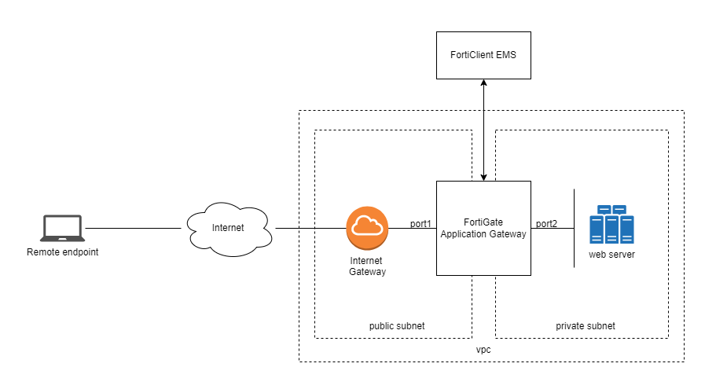

## Description

Deploy a single BYOL FortiGate in AWS using CloudFormation with preconfigured ZTNA settings

## Deployment overview

This deployment requires that you already have the following already configured:

-   A VPC
-   Two subnets - **Public and Private Subnets**
-   A existing Web Server inside the private subnet.  Used for testing ZTNA application access.
-   S3 bucket in the same region where the CloudFormation template will deploy in.

### Cloudformation deploys the following components:

-   A FortiGate BYOL instance with two NICs, one in each subnet
-   An S3 endpoint inside the public subnet. (Depends on if already existed)
    S3 endpoint is used for connecting to the S3 bucket via internally.
-   A Lambda function.

### Topology diagram:

## Deployment:

1. Fill in the parameters as shown below:

#### VPC Configuration

|   Parameters   |   Description   |
|----------------|-----------------|
| VPCID | Select the existing VPC to use. |
| VPCCIDR | Provide a network CIDR for the VPC. |
| PublicSubnet  | Select the existing subnet for PublicSubnet  |
| PrivateSubnet  | Select the existing subnet for PrivateSubnet  |

#### ZTNA Gateway Instance Configuration
|   Parameters   |   Description   |
|----------------|-----------------|
| FortiOSVersion  | FOS Version  |
| InstanceType  | Instace type for the ZTNA Gateway instance  |
| LocalUsername  | The name of the localuser used for authentication when accessing ZTNA Application  |
| LocalUserPassword  | The pasword of the localuser used for authentication when accessing ZTNA Application  |
| PublicSubnetRouterIP  | Provide the IP address of the AWS intrinsic router (First IP from PublicSubnet)  |
| PrivateSubnetRouterIP  | Provide the IP address of the AWS intrinsic router (First IP from PrivateSubnet)  |
| S3EndpointDeployment  | Select if a new S3 Endpoint should be deployed or not.  Default is UseExisting.  |
| PublicSubnetRouteTableID  | If a new S3 Endpoint is to be deployed, provide the route table ID associated to PublicSubnet  |
| InitS3Bucket  | S3 Bucket name where the config files, and license file is stored.  The bucket should exist in the same region as this deployment for succesful bootstrapping.  |
| LicenseType  | License Type for the ZTNA Gateway  |
| ZTNAGatewayLicenseFile  | Provide the name of the BYOL license file in the Init S3 Bucket for ZTNA Gateway (ie fgt.lic or prefix/fgt.lic)  |
| CIDRForInstanceAccess  | CIDR Range to allow access. 0.0.0.0/0 to allow all.  |
| EncryptVolumes  | To encrypt the instances OS and log volumes disk  |
| KeyPair  | Select a SSH keypair to associate with the ZTNA Gateway  |

#### EMS Configurations
|   Parameters   |   Description   |
|----------------|-----------------|
| FortiOSVersion  | FOS Version  |
| EMSServerType  | Select the EMS Server type for the ZTNA Gateway.  Default is Cloud.  |
| EMSServerIP  | If OnPremise from EMSServerType is choosen, then needs to provide the IP address in CIDR form for the EMS Server's Public IP accessible.  |
| EMSServerPort  | If OnPremise from EMSServerType is choosen, then needs to provide the Port to connect to the EMS Server Public IP.  |

#### Interface IP Configuration for ZTNA Gateway
|   Parameters   |   Description   |
|----------------|-----------------|
| FortiOSVersion  | FOS Version  |
| ZTNAGatewayPublicIP  | Provide the IP address in CIDR form for the public interface of ZTNA Gateway (IP from PublicSubnet)  |
| ZTNAGatewayPrivateIP  | Provide the IP address in CIDR form for the public interface of ZTNA Gateway (IP from PublicSubnet)  |

#### Server Configuration
|   Parameters   |   Description   |
|----------------|-----------------|
| ServerPrivateIP  | Provide the Private IP address in CIDR form for the private interface of Application Server (IP from PrivateSubnet)  |
| ServerName  | Provide the name for the Application Server.  |

 2. Continue to deploy the stack.

 3. Outputs.  Provides the URL to login to ZTNAApplication and ZTNAGateway along with the login credential.  It is advised to modifed this once login to the ZTNAGateway

## Destroy the stack

To destroy the stack, choose the stack and click on `Delete`

## Additional Resources
To learn more about what Zero Trust Application Gateway is, and how it protects your SaaS applications:

[About Zero Trust Application Gateway](https://docs.fortinet.com/document/fortigate-public-cloud/7.2.3/zero-trust-application-gateway-admin-guide/265973/about-zero-trust-application-gateway)

To learn how to get started in deploying your Zero Trust Application Gateway in the Cloud:

[Getting started](https://docs.fortinet.com/document/fortigate-public-cloud/7.2.3/zero-trust-application-gateway-admin-guide/738725/getting-started)

To upgrade to newer version of FortiOS, please follow the procedures detailed here:

[Upgrading the firmware](https://docs.fortinet.com/document/fortigate/latest/administration-guide/596131/upgrading-individual-device-firmware)

## Support

Fortinet-provided scripts in this and other GitHub projects do not fall under the regular Fortinet technical support scope and are not supported by FortiCare Support Services.
For direct issues, please refer to the [Issues](https://github.com/fortinet/fortigate-terraform-deploy/issues) tab of this GitHub project.
For other questions related to this project, contact [github@fortinet.com](mailto:github@fortinet.com).

## License

[License](https://github.com/fortinet/fortigate-terraform-deploy/blob/master/LICENSE) © Fortinet Technologies. All rights reserved.
